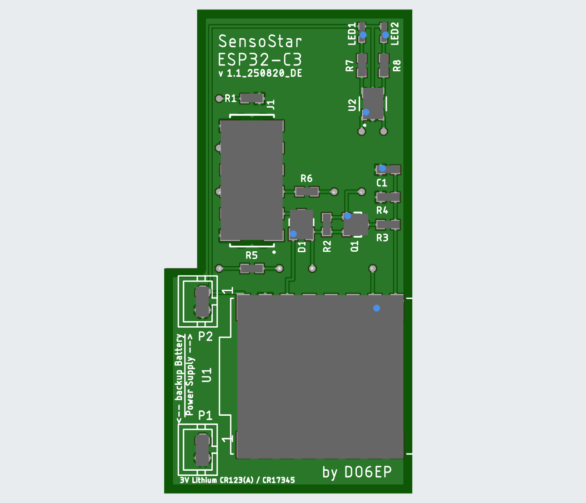
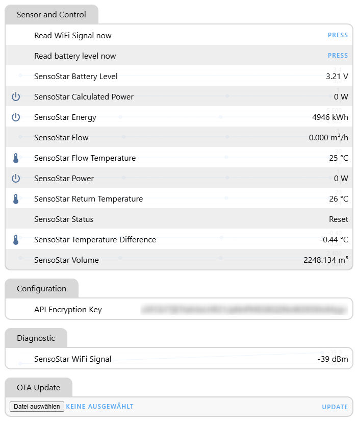
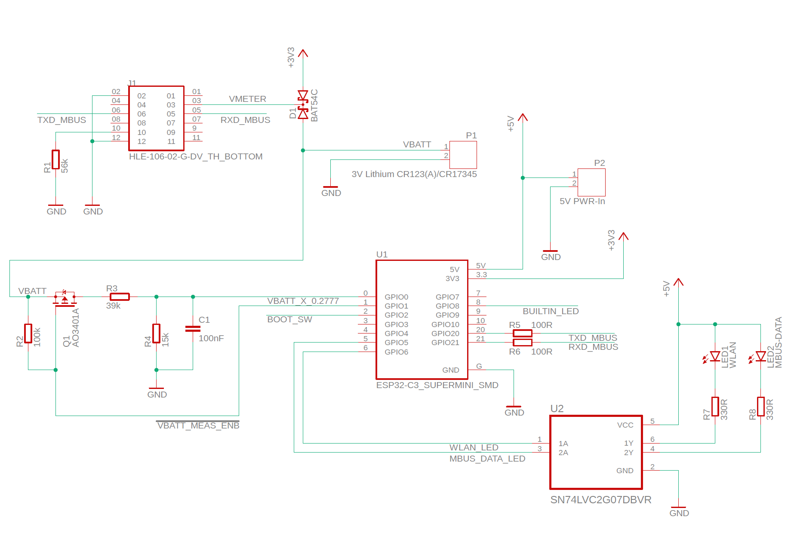

# esphome-sensostar

**Custom ESPHome Component for Engelmann SensoStar Heat Meters**

This ESPHome integration enables reading detailed heat consumption data from Engelmann SensoStar U heat meters and makes it available in Home Assistant.

Same as Project from STB3 but this one uses "ESP32-C3 Super Mini" **including PCB-Data** for production.

Boards can currently be ordered from AISLER (https://aisler.net/p/IZCPMTQC).

** Now testing with "Xaio ESP32S3" this Module is more powerfull.
** Rev. 2 with "Xaio ESP32S3" is in work.

---

## 🔧 Features

- 📊 **Sensor Readings**
  - Energy consumption (kWh)
  - Flow rate (m³/h)
  - Volume (m³)
  - Power (W)
  - Flow temperature (°C)
  - Return temperature (°C)
  - Temperature difference (ΔT)
  - Meter status (text)
  - Battery voltage (via ADC)
  - Battery Status

- 🧠 **Home Assistant Integration**
  - Native API support
  - OTA updates
  - Web dashboard (optional)

- 🔗 **MQTT Integration**
  - Configurable MQTT support via web UI (thanks to the work of STB3)

- 🕹 **Controls**
  - Template button in Home Assistant for instant battery reading
  - Template button in Home Assistant for instant Wi-Fi signal strength reading

- 💡 **LED Indicators**
  - Wi-Fi connection status
  - New data received from the SensoStar meter
  - Heartbeat (device activity, via builtin LED)


---

## 🧪 Requirements

- ESP32-C3 SuperMini (4MB Flash) or Xaio ESP32S3 (4MB Flash) 
- Engelmann SensoStar U or E meter without any optional interfaces
- ESPHome installed on your system
- Home Assistant (optional but recommended)


---

## 🔌 Hardware Wiring

The SensoStar meter uses a 12-pin internal connector for communication and power. Below is the pinout and how to wire it to an ESP32:

| Pin | Function                     | Connection                                     |
|-----|------------------------------|------------------------------------------------|
| 1   | NC                           | —                                              |
| 2   | GND                          | Connect to ESP32 GND                           |
| 3   | VCC                          | Connected to the internal battery of the meter |
| 4   | NC                           | —                                              |
| 5   | RX                           | Connect to ESP32 UART TX                       |
| 6   | TX                           | Connect to ESP32 UART RX                       |
| 7   | NC                           | —                                              |
| 8   | NC                           | —                                              |
| 9   | NC                           | —                                              |
|10   | HW Detect (56kΩ to GND)      | Connect a 56kΩ resistor to GND                 |
|11   | NC                           | —                                              |
|12   | GND                          | Connect to ESP32 GND                           |

> **Note:** "NC" means *Not Connected*. Be sure to use level shifting or protective circuitry if needed, depending on your ESP32 model and power requirements.


---

## 📷 Example Hardware

Below is a visual example of the wired hardware setup.

### Image



### Web-Interface



### Schematics



---

## 🚀 Setup Instructions

1. **Install ESPHome**  
   [ESPHome installation guide](https://esphome.io/guides/installing_esphome.html)

2. **Clone or reference this repository** in your ESPHome config:
   ```yaml
   external_components:
     - source:
         type: git
         url: https://github.com/do6ep/esphome-sensostar
       components: [ SensoStar_MBus ]
   ```

3. **Create a `secrets.yaml` file** in the same folder as your ESPHome config file (`sensostar.yaml`):

   ```yaml
   # secrets.yaml
   wifi_ssid: "YourSSID"
   wifi_password: "YourPassword"
   api_encryption_key: "YourAPIKey"  # Generate with: openssl rand -base64 32
   ```
   [Generate the key online](https://www.cryptool.org/en/cto/openssl/)
   
4. **Build and upload your firmware:**
   ```bash
   cd path\to\your\config
   esphome run sensostar.yaml
   ```
   
5. **Fallback in case no credential were found**

   You can then access the device's web interface at the default IP address 192.168.4.1
   and enter your SSID and password


---

## 📦 Repository Contents

- `components/SensoStar_MBus/`: Custom ESPHome component for the SensoStar M-Bus meter
- No user-specific configuration files are committed (e.g. `sensostar.yaml` or `secrets.yaml`)

---

## 🔐 Security Note

This repository **does not** contain any private configurations. Be sure to:
- Use `secrets.yaml` to keep credentials out of your main config
- Add `.gitignore` rules to exclude secrets from being committed

```gitignore
# .gitignore
secrets.yaml
*.key
*.pem
```

---

## 📫 Contact

Maintained by **do6ep**  
For issues or feature requests, open an issue in the [GitHub repository](https://github.com/do6ep/esphome-sensostar/issues).

---

## 📝 License

This project is open-source and licensed under the MIT License.
